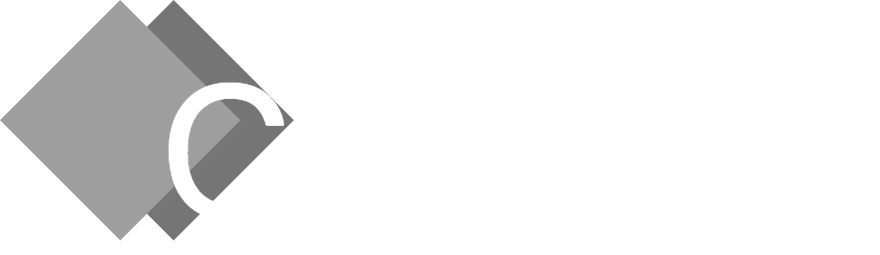

<p align="center">
  
</p>
<p align="center">
    <strong>The Cascade programming language</strong>
</p>
<p align="center">
    <em>A source-to-source compiled strictly-typed programming language.</em>
</p>
<p align="center">
  
  
  
  
</p>

---

**Cascade** is a strongly-typed, imperative programming language that transpiles directly into clean, efficient Go code before compiling into standalone, high-performance `.exe` binaries. It combines a clean, expressible syntax with high-speed execution, static type checking, and rich built-in libraries for system and pseudo-symbolic graphics development.

> [!WARNING]
> **Prerequisites for Compilation:**
> Before compiling projects, ensure you have copied the `go` compiler directory into the Cascade installation root folder. 
> The target folder name must be strictly named `go`.
> 
> If you download the release, you don't need to install anything separately.

## Key Features
* **Static Type Checking** — Catches type mismatches, unimported modules, and syntax issues at compile time.
* **Transpiled to Go** — Generates fast, native machine code with zero external runtime dependencies on the target machine.
* **Modern Control Flow** — Structured functions, flexible loops (`while`, `for ... to`, `foreach`), mutation controls (`mut`, `incr`), and expressible conditional logic.
* **Pseudo-Symbolic Graphics (`psgraph`)** — Built-in library for flicker-free ANSI console positioning, cursor management, and terminal UI/3D rendering.
* **Rich Standard Ecosystem** — Native support for string manipulation, file system iteration (`walk`, `readline`), array operations, and system utilities.

## Code Examples

### *Hello, World!*
```cascade
use <std>

pre func main() {
    std::echo("Hello, World!")
    std::pause()
}

```

### *Functions, Mutations & Expressions*

```cascade
use <std>

func add(a : int, b : int) -> int {
    return a + b
}

pre func main() {
    x : int := 5
    y : int := 10
    
    // Direct function call in expression & condition
    if (add(x, y) == 15) {
        writeln("Result is exactly 15!")
    }

    // Mutating and incrementing variables
    x = 20
    incr x +
    writeln(x) // Prints 21
}

```

### *Console Pseudo-Graphics (`psgraph`)*

```cascade
use <psgraph>
use <env>

pre func main() {
    psgraph::hide_cursor()
    psgraph::clear()

    // Draw at specific screen coordinates (X, Y)
    psgraph::gotoxy(10, 5)
    write("Point A")

    psgraph::gotoxy(20, 5)
    write("Point B")

    psgraph::gotoxy(0, 10)
    psgraph::show_cursor()
}

```

### *Loops & File System Processing*

```cascade
use <std>

func main() {
    // Range loops
    for (i : 1 to 10) step 1 {
        writeln(i)
    }

    // Processing file lines
    readline (line in "data.txt") {
        writeln(line)
    }
}

```

## Compilation & Usage

To compile a Cascade script (`.csc`) into a native executable `.exe`, run the Cascade CLI tool:

```powershell
csc script.csc

```

This transpiles the script into optimized Go code and invokes the compiler to produce a standalone `.exe` binary ready to execute on Windows.
